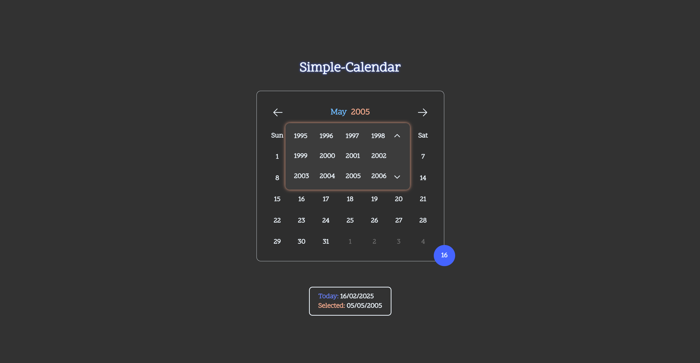

# Simple-Calendar 🗓️

A clean and intuitive calendar interface using fundamental web technologies. This project provides a simple way to view dates, navigate between months and years, and quickly jump to the current date. It's an excellent learning opportunity for developers on their beginner's journey of web development to understand core concepts.

## Features

- **Month Navigation:** Easily navigate to the next or previous month using arrow controls.
- **Year Selection:** Select your desired year by clicking on the displayed year and choosing from a grid of available years.
- **Month Selection:** Quickly jump to a specific month by clicking on the current month display and selecting the desired month from a grid of available months.
- **Date Highlighting:** The current day is visually highlighted for easy identification.
- **Selected Date Awareness:** Clear indication of the currently selected date.
- **"Jump to Today" Functionality:** A convenient "jump to today" ball allows you to quickly return to the current date from any point in the calendar.

## Tech Stack

- HTML
- CSS
- JavaScript

## Installation

1. Clone the repository:
   ```shell
   git clone https://github.com/U-Jayadhar/Simple-Calendar.git
   ```
2. Navigate to the project directory:
   ```shell
   cd Simple-Calendar
   ```
3. Open the index.html file in your web browser.

## Demo

Access the Simple-Calendar live here 👉 [Simple-Calendar Website](https://u-jayadhar.github.io/Simple-Calendar/)

## Screenshots




## Author

Developed by Jayadhar Ummadisingu 😎
