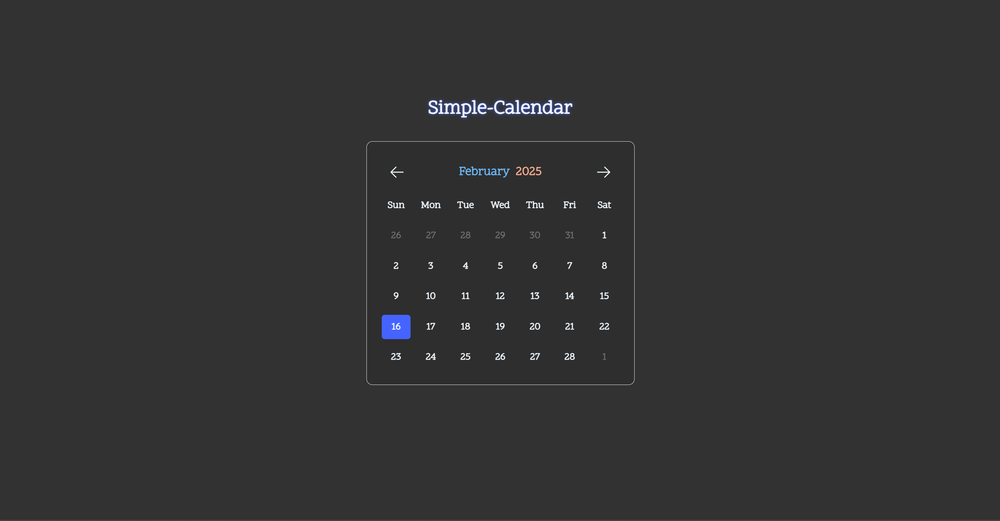

# Simple-Calendar 🗓️

A straightforward and user-friendly calendar interface built using fundamental web technologies. This project provides a simple way to view dates, navigate between months and years, and quickly jump to the current date. It's an ideal project for beginners looking to understand core web development concepts.

## Features

- **Month Navigation:** Easily view the current month and navigate to the next or previous month using intuitive arrow controls.
- **Year Navigation:** Select your desired year by clicking on the displayed year and choosing from a grid of available years.
- **Month Selection:** Quickly jump to a specific month by clicking on the current month display and selecting the desired month from a dropdown.
- **Date Highlighting:** The current day is visually highlighted for easy identification.
- **Selected Date Awareness:** Clear indication of the currently selected date.
- **"Jump to Today" Functionality:** A convenient "jump to today" button allows you to quickly return to the current date from any point in the calendar.

## Tech Stack

- HTML 
- CSS 
- JavaScript

## Installation

1. Clone the repository:
   ```shell
   git clone https://github.com/U-Jayadhar/Simple-Calendar.git
   ```
2. Navigate to the project directory:
   ```shell
   cd Simple-Calendar
   ```
3. Open the index.html file in your web browser.

## Screenshots




## Author
By Jayadhar Ummadisingu 😎